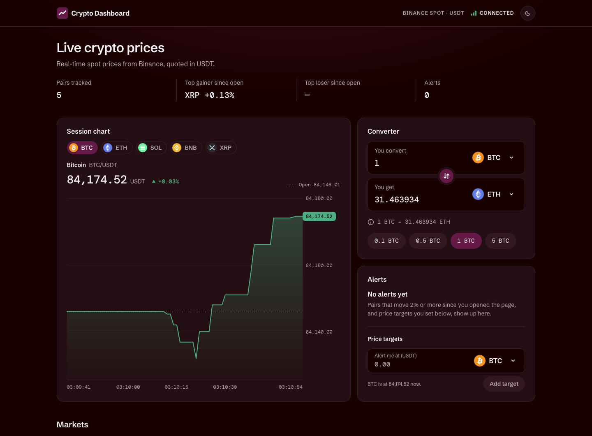

# Crypto Dashboard

A real-time cryptocurrency dashboard built with React and TypeScript on live Binance WebSocket data. Frontend only, no backend.

**Live demo:** https://crypto-exchange-dashboard-zeta.vercel.app



It covers all 9 requirements of the brief and all 6 bonus tasks: session price chart, adding and removing pairs, subscribe/unsubscribe on the open socket, price target alerts, light/dark theme, and unit tests.

## Installation

Requires **Node.js 22.13+ or 24** (see `.nvmrc`).

```bash
npm install
```

## Running

```bash
npm run dev       # development server at http://localhost:5173
npm run build     # type-check and build for production into dist/
npm run preview   # serve the production build
npm test          # unit tests (Vitest)
npm run lint      # ESLint
npm run format    # Prettier
```

No API keys are needed, because Binance market data is public.

## Libraries

- **React 19** and **TypeScript 6** (strict mode, no `any`)
- **Vite 8**: dev server and build
- **Zustand 5** with `persist`: app state; preferences are saved to `localStorage`
- **Vitest 5**: unit tests
- **ESLint 10**, **typescript-eslint** and **Prettier**: linting and formatting
- **cryptocurrency-icons** and **@fontsource**: coin logos and self-hosted fonts

The price chart is hand-made (an SVG line with HTML labels), with no chart library.

## Architecture

```
src/
├── domain/      Pure logic: % change, alert rules, conversion, input validation,
│                search, sorting, chart maths. No React. Unit-tested.
├── services/    Binance: the BinanceSocket class (WebSocket lifecycle),
│                the REST price snapshot, message parsing.
├── store/       Zustand: marketStore (live prices, alerts, connection state)
│                and preferencesStore (saved user settings).
├── hooks/       Connect services to the stores (live feed, snapshot, theme).
├── containers/  Read the stores and prepare data for the components.
└── components/  Presentational components: props in, JSX out.
```

**Data flow:** Binance WebSocket → `BinanceSocket` → `useMarketFeed` (applies updates every 250 ms) → `marketStore` → containers → components.

ESLint enforces the layers: components cannot import stores, services, hooks or containers, and `domain/` and `services/` cannot import React.

## Technical decisions and assumptions

- **"Price change"** means the % change since the first price received for each pair (when the page loaded, or when the pair was added). The column, the sorting and the alerts all use this number.
- **±2% alerts** fire once when a pair crosses the threshold. They fire again in the same direction only after the pair has come back inside ±1.5%, which prevents duplicate alerts.
- **Reconnecting** uses exponential backoff with jitter (up to 30 s between tries). After 10 failed reconnect attempts in a row it stops and shows a Retry button. A watchdog checks whether a silent connection is still alive before replacing it.
- **Changing pairs** sends `SUBSCRIBE` / `UNSUBSCRIBE` on the open connection; it never reconnects.
- **Updates are batched**: prices are applied every 250 ms (the latest price wins), which limits re-renders.
- **Two stores**: live prices stay in memory; favorites, hidden pairs and other preferences are saved to `localStorage` and validated when loaded.
- **The converter goes through USDT** (USDT = 1). Inputs reject negatives, signs and exponent notation such as `1e5`.
- **Hidden pairs** keep updating but don't raise ±2% alerts.

The full reasoning, including the alternatives considered, is in [DECISIONS.md](DECISIONS.md).
