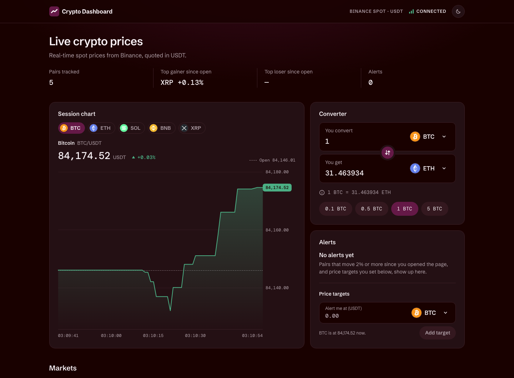

# Crypto Dashboard

A real-time cryptocurrency dashboard built with React and TypeScript. It streams live spot prices from the public Binance WebSocket API, with no backend.

**Live demo:** https://crypto-exchange-dashboard-zeta.vercel.app



## Features

| Brief                          | What the app does                                                                                                                                                                                                    |
| ------------------------------ | -------------------------------------------------------------------------------------------------------------------------------------------------------------------------------------------------------------------- |
| 1. Live rates                  | Five USDT pairs by default (BTC, ETH, SOL, BNB, XRP), updated live without a page refresh. Each row shows the symbol, price, direction, favorite star and a hide button.                                             |
| 2. Price change indicator      | The price digits flash green or red on every change, and the "Since open" column shows an arrow and a colour.                                                                                                        |
| 3. Significant change alert    | The first price after page load is the baseline. A move of ±2% or more raises one alert with the name, initial price, current price, % change and direction. It re-arms only after the pair calms back inside ±1.5%. |
| 4. Calculator                  | Convert between any tracked coin and USDT at live prices. Select, swap, quick amounts and validation for empty, negative, invalid and `e` notation input.                                                            |
| 5. Favorites                   | Star a pair and switch between All and Favorites. Saved in `localStorage`.                                                                                                                                           |
| 6. Hide currencies             | Hide a pair, then view and restore hidden pairs one by one or all at once. Saved in `localStorage`.                                                                                                                  |
| 7. Search and sorting          | Search by name, symbol or pair (`bit`, `BTC`, `btc/usdt`). Sort by name, current price or % change since open. Rows don't jump while your pointer or keyboard focus is in the table.                                 |
| 8. WebSocket state             | A header badge shows Connecting, Connected, Reconnecting (try n), Disconnected (offline), and Connection lost with a Retry button. Automatic reconnect with backoff, and full cleanup on unmount.                    |
| 9. UI states                   | Loading skeletons, connected, reconnecting, disconnected, error, empty search, empty favorites and all pairs hidden.                                                                                                 |
| Bonus: session chart           | A price chart per pair built from data collected this session, with price and time axes, the opening price as a dashed line and a hover or touch readout.                                                            |
| Bonus: add / remove pairs      | "Edit pairs" lets you follow any of 18 supported coins. The list is saved.                                                                                                                                           |
| Bonus: subscribe / unsubscribe | Changing pairs sends `SUBSCRIBE` / `UNSUBSCRIBE` diffs on the open socket, paced to stay under Binance's rate limit. It never reconnects.                                                                            |
| Bonus: price targets           | Choose a coin and a target price ("alert me when BTC rises above 90,000"). Targets are saved and fire once.                                                                                                          |
| Bonus: light / dark theme      | Follows the system by default. The toggle choice is saved and applied before first paint, so there's no flash.                                                                                                       |
| Bonus: unit tests              | 151 Vitest tests, including the calculator, % change, alert rules, the socket's reconnect logic, sorting, search and stores.                                                                                         |

The layout is responsive down to 320px wide. Every control is keyboard accessible and has an accessible name. Focus moves to a neighbouring control when the one you used disappears (hide, dismiss, restore), and live prices never trigger screen-reader announcements on their own.

## Getting started

Requirements: **Node.js 22.13+ or 24** (see `.nvmrc`) and npm.

```bash
npm install
npm run dev        # http://localhost:5173
```

| Script               | What it does                               |
| -------------------- | ------------------------------------------ |
| `npm run dev`        | Start the Vite dev server                  |
| `npm run build`      | Type-check, then build to `dist/`          |
| `npm run preview`    | Serve the production build locally         |
| `npm test`           | Run the unit tests once                    |
| `npm run test:watch` | Run the tests in watch mode                |
| `npm run typecheck`  | TypeScript only                            |
| `npm run lint`       | ESLint                                     |
| `npm run format`     | Prettier (write); `format:check` to verify |

No API keys or environment variables are needed. Binance market data is public.

> In development, React StrictMode mounts components twice, so you may see one "WebSocket is closed before the connection is established" warning in the console. It's the first, throw-away socket being cleaned up. Production opens exactly one socket.

## Libraries

| Library                                          | Why                                                                                                                                      |
| ------------------------------------------------ | ---------------------------------------------------------------------------------------------------------------------------------------- |
| **React 19** + **TypeScript 6** (strict)         | UI and types. Strict mode plus `noUncheckedIndexedAccess`, no `any`.                                                                     |
| **Vite 8**                                       | Dev server and build.                                                                                                                    |
| **Zustand 5** (+ `persist`)                      | Small global stores with selector subscriptions, so a component re-renders only when its slice changes. `persist` covers `localStorage`. |
| **Vitest 5**                                     | Unit tests that share Vite's config.                                                                                                     |
| **ESLint 10** + typescript-eslint + **Prettier** | Strict type-checked lint rules, React hooks rules and **architecture boundaries** (see below). Prettier handles formatting.              |
| cryptocurrency-icons                             | Coin logos as local SVG assets, so no image CDN is needed.                                                                               |
| @fontsource (Schibsted Grotesk, DM Mono)         | Self-hosted fonts. DM Mono gives prices fixed-width digits, so numbers don't jitter as they update.                                      |

The chart is plain SVG. No chart library is used (see [DECISIONS.md](DECISIONS.md#20-hand-drawn-svg-chart-instead-of-a-chart-library)).

## Architecture

```
src/
├── domain/       Pure TypeScript: types, % change, alert rules, conversion, parsing,
│                 search, sorting, chart maths. No React, no I/O. Unit tested.
├── services/     Binance I/O: BinanceSocket (plain TS class), REST snapshot, message parsing.
├── store/        Zustand: marketStore (live, in memory) and preferencesStore (persisted).
├── hooks/        Bridges between services and stores (socket feed, snapshot, theme).
├── containers/   Read stores, derive view data, wire actions. One per screen area.
├── components/   Presentational only: props in, JSX out.
├── config/       The catalog of supported pairs and the defaults.
└── styles/       Design tokens (light and dark) and global CSS.
```

**Data flow**

```
Binance WebSocket ──► BinanceSocket ──► useMarketFeed ──(batch every 250ms)──► marketStore ──► containers ──► components
  (miniTicker)        reconnect, watchdog,     latest price per pair,          prices, alerts,      (selectors)     (props)
                      subscribe diffs          checks price targets            connection state
Binance REST  ──► useTickerSnapshot ─────────────────────────────────────────► marketStore
localStorage  ◄──► preferencesStore (pairs, favorites, hidden, view, sort, targets, theme) ◄──► containers
```

- **`BinanceSocket`** has no React in it. It owns the connection lifecycle: connect, subscribe, reconnect with exponential backoff and full jitter, a watchdog that checks a quiet connection is still alive before replacing it, and pausing while the browser is offline. Its public methods are `connect`, `disconnect`, `setSymbols`, `getState` and two listener methods (`onStateChange`, `onTicker`). Its network status, randomness and `WebSocket` constructor are injectable, so the tests drive it with fakes and fake timers.
- **`useMarketFeed`** is the only place the socket meets React. It creates one socket for the app's lifetime, sends pair changes to `setSymbols`, and cleans up everything (timer, listeners, socket) on unmount.
- **Two stores.** Live prices change several times a second and must never be written to `localStorage`. Preferences change rarely and must survive a reload. Keeping them apart means `persist` never serialises price data.
- **Layers are enforced, not just a convention.** ESLint's `no-restricted-imports` fails the lint if a component imports a store, service, hook or container, or if `domain/` or `services/` import React or a store.

## Decisions and assumptions

The short version is below. Every decision, with the alternatives and trade-offs, is in **[DECISIONS.md](DECISIONS.md)**.

- **"Price change" means % change since you opened the page**, the same number the ±2% alert uses. It is not Binance's 24-hour change, because the brief defines "initial price" as the first price received after load.
- **The baseline is the first price received for each pair.** It lives in memory, so a reload starts a new session, as the brief's "since you opened the page" implies.
- **±2% is inclusive**, measured on the value as displayed (rounded to 2 decimals). After an alert, a pair must calm back inside ±1.5% before it can alert again. This stops a price hovering around 2% from spamming alerts.
- **Alerts are muted for hidden pairs.** You asked not to see them. Price targets you set explicitly still fire.
- **Updates are batched** into one store write every 250ms (latest price wins), so the UI renders at most 4 times per second however many messages arrive.
- **Reconnect** uses exponential backoff with full jitter (1s, 2s, 4s … capped at 30s). After 10 failed reconnect attempts it stops and shows a Retry button instead of retrying forever.
- **Conversion goes through USDT**, with USDT priced at exactly 1.
- **The pair catalog is fixed** (18 USDT pairs with names and icons). The Binance stream only sends symbols, so names for search come from this catalog.
- **Saved preferences are validated** when loaded. Unknown symbols, wrong types or corrupted JSON fall back to defaults instead of crashing the app.

## Testing

```bash
npm test
```

- **Domain:** % change, alert zones and hysteresis, rounding, conversion, amount parsing (negatives, `e` notation, commas), search, sorting, price targets, chart scaling and ticks, history thinning.
- **Services:** the `BinanceSocket` state machine runs against a fake `WebSocket` with fake timers. It covers subscribing on open, subscribe/unsubscribe diffs without reconnecting, pacing bursts of changes, reconnect and backoff, giving up and Retry, stale-socket events, the watchdog and its liveness check, and offline/online. Protocol parsing and backoff maths are tested too.
- **Stores:** applying tickers, alert muting, forgetting removed pairs, bounded alert history, and sanitising saved preferences.

## Deployment

Vercel builds the `main` branch automatically (`vercel.json`: Vite preset, `npm run build`, `dist/`, long-lived cache headers for hashed assets).
